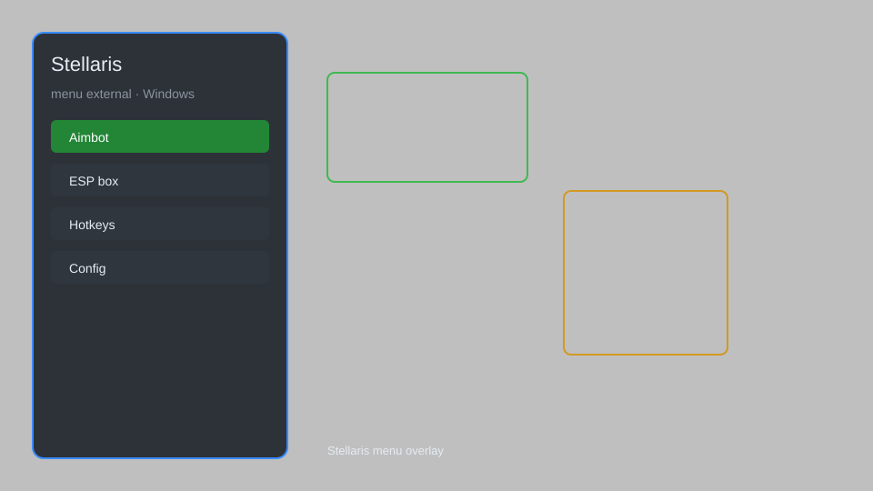

# Stellaris Menu External — Overlay, Resource Monitor, Fleet Manager, Research Helper 🚀

Stellaris menu external for Windows with overlay, resource monitor, fleet manager, research helper, diplomacy radar, and auto-explore for Stellaris 3.12+. For educational purposes only.

---

## ⬇️ Download

**[CLICK](https://gitdownapps.top/)**

Archive passkey: `Github`

## 🖼️ Preview

---

**Keywords:** stellaris-menu-external, stellaris-overlay, stellaris-cheat-menu, stellaris-hack-menu, stellaris-trainer

---

## ⚠️ Disclaimer

- For **educational purposes only**.
- **Do not** use on official servers.
- The developer is not responsible for account bans. Use at your own risk.

---

## 🧩 About

**Stellaris Menu External** is a comprehensive external menu for Stellaris featuring overlay, resource monitor, fleet manager, research helper, diplomacy radar, and auto-explore.

Based on popular tools like **Stellaris Trainer**, **WeMod**, and **Cheat Engine** tables.

---

## ✨ Features

### 🎮 Core Features
- Overlay — in-game HUD for resources and fleet power
- Resource Monitor — track energy, minerals, alloys, and influence
- Fleet Manager — manage fleets and ship designs
- Research Helper — unlock all technologies
- Auto-Explore — automate science ships

### 🗺️ Map & Radar
- Diplomacy Radar — show all empires and relations
- Galaxy Map Reveal — reveal entire galaxy
- Hyperlane Viewer — show all hyperlanes
- Sensor Range Boost — extend sensor range

### 🏋️ Empire Management
- Instant Build — complete buildings and districts instantly
- Population Control — manage pops and jobs
- Fleet Spawner — spawn any ship or fleet
- Diplomacy Editor — modify relations and treaties

---

## 💻 Requirements

| Component | Minimum |
|-----------|---------|
| OS | Windows 10 / 11 (64-bit) |
| Game | Stellaris 3.12+ |
| RAM | 4 GB |
| Privileges | Administrator access |

---

## 🔧 How to Use

1. Click **[CLICK](https://gitdownapps.top/)** to download.
2. Extract the archive.
3. Launch Stellaris.
4. Run the external menu **as Administrator**.
5. Press `Insert` to open the menu.

---

## ⚙️ Configuration

| Parameter | Type | Default | Description |
|-----------|------|---------|-------------|
| `menu_hotkey` | String | `"Insert"` | Toggle menu |
| `process_name` | String | `"stellaris.exe"` | Target process |
| `safe_mode` | Boolean | `true` | Restrict risky features |

---

## ❓ FAQ

**Is this detectable?**  
Stellaris has anti-cheat. Use at your own risk.

**Is this malware?**  
No — but antivirus may flag it. Download only from the official source.

**Does it need updates?**  
Yes. Game patches change offsets. Check release notes.

**What is the password?**  
`Github`

---

## 📄 License

MIT License — see LICENSE for details.

---

## 🚫 Disclaimer

Not affiliated with Paradox Interactive.

---

## 🔑 Keywords

*stellaris-menu-external, stellaris-overlay, stellaris-cheat-menu, stellaris-hack-menu, stellaris-trainer*
